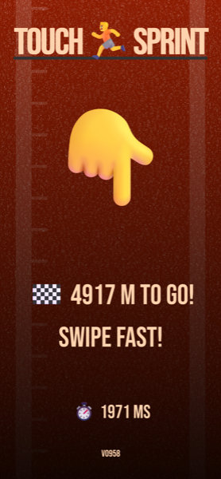

# Touch Sprint 5000

A running game for your fingers on a touch screen. Developed at Vincit Hackfest 2023.

## Try it
Go ahead, try it on your mobile at https://mikkosiikaniemi.github.io/touch-sprint-5000/.

Developed using Firefox (responsive design mode, touch simulation) and tested with iOS 17 Safari.

## Credits
Most of the JavaScript code generated with help from [ChatGPT-3.5](https://chat.openai.com/c/e54d0bd1-65b8-490b-972e-e6785e3f478a).

Background SVG image texture generated with [nnnoise](https://fffuel.co/nnnoise/) and optimized with [SVGOMG](https://jakearchibald.github.io/svgomg/).
